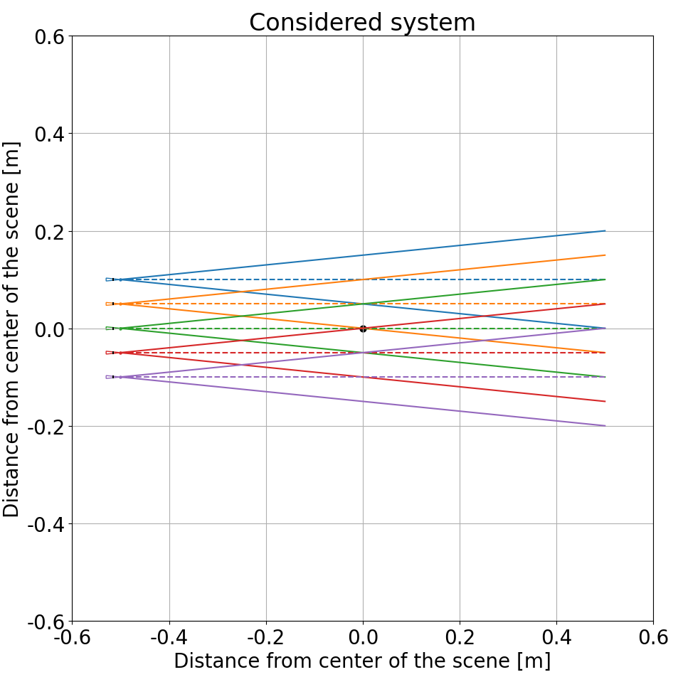
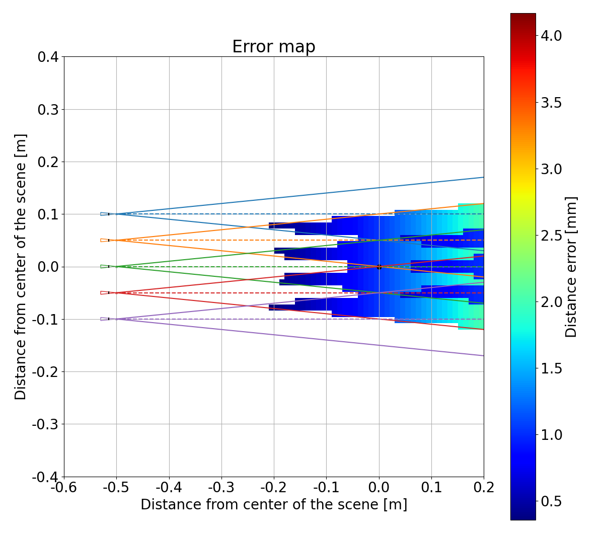
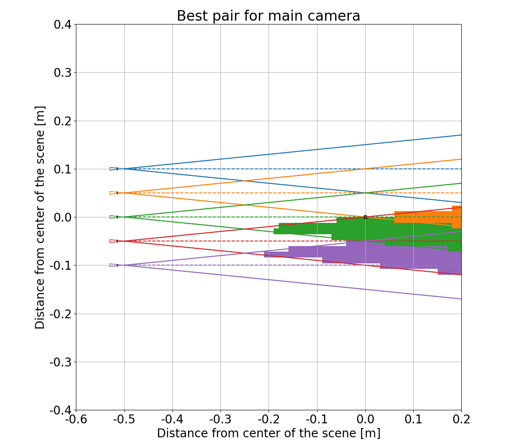
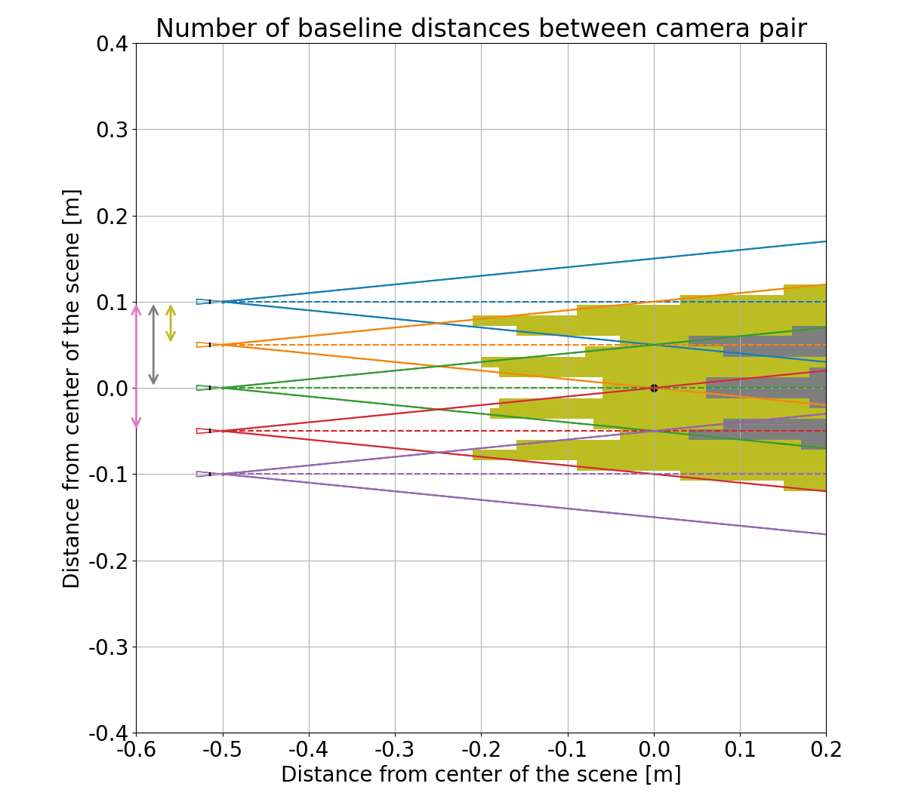

# DepthEstAcc - depth accuracy estimation for multicamera systems


## Description

The presented software addresses a crucial challenge in depth estimation for static and moving scenes in multicamera systems by determining the maximum theoretically achievable quality of depth estimation. It focuses on estimating the geometry of multicamera scenes, an area extensively researched due to its importance in various applications, such as virtual reality. The software calculates the minimal possible depth estimation error for a given camera arrangement, based on a disparity-based approach, providing valuable insights into the optimal configuration of cameras for high-precision depth mapping. This is particularly relevant for setups in immersive video and other applications requiring accurate scene reconstruction. While the software does not account for factors like occlusions or camera imperfections, it offers a powerful tool for analyzing and optimizing camera arrangements, potentially improving the overall quality of the system before complex processes like calibration are performed.

### Supported camera arrangements

* **Linear arrangement (v1.0):** homogeneous, parallel camera setups along a baseline.
* **Circular arrangement (v1.0):** homogeneous camera setups placed along a circular arc.
* **Custom arrangement (new in v2.0):** fully flexible, arbitrary camera positioning with individual coordinates (`X_mm`, `Y_mm`), orientation (`Angle_deg`) and optional per-camera optical parameters.

---

## What's new in version 2.0

* **`Custom` mode:** removes structural constraints, allowing arbitrary placement and orientation of each camera on a 2D plane.
* **Heterogeneous camera parameters:** per-camera focal length (`FocalLength_mm`), sensor width (`SensorWidth_mm`) and resolution (`Resolution_px`).
* **Per-camera depth uncertainty maps:** depth estimation uncertainty is evaluated and rendered independently along each camera's optical axis rather than with a single global projection, which correctly handles intersecting or divergent optical axes.
* **New display options:** `DrawDepthRegion`, `DrawIntersectionExample` and `OnlyMainCameraCalculate`.
* **Backward compatibility:** configuration files created for v1.x work in v2.0 without any modifications.

### Version history

* **v2.0** - Custom camera arrangement, per-camera parameters and per-camera depth uncertainty maps.
* **v1.1** - choice between the full ray-tracing method and the simplified analytical model (`DrawSimplified`).
* **v1.0** - initial release (linear and circular arrangements), described in: J. Stankowski, K. Klimaszewski, A. Grzelka, *DepthEstAcc - software for estimating the accuracy of the depth estimation in a multicamera system*, SoftwareX, 2025, [doi:10.1016/j.softx.2025.102417](https://doi.org/10.1016/j.softx.2025.102417).


## Authors

* Jakub Stankowski - Poznan University of Technology, Poznań, Poland
* Krzysztof Klimaszewski - Poznan University of Technology, Poznań, Poland
* Adam Grzelka - Poznan University of Technology, Poznań, Poland
* Hubert Żabiński - Poznan University of Technology, Poznań, Poland

## License

3-Clause BSD License

## Requirements

* Python 3.8 or newer
* Python libraries: numpy, matplotlib, shapely

```
pip install numpy matplotlib shapely
```

## Usage

The software is delivered as a Python script. The configuration is read from the `config.json` file located in the working directory.

Fill the file with your data and run the script:

`python depth_err.py`

## Configuration file

The behaviour of the script is defined by the contents of the configuration file named `config.json`. A template is provided for modification.

### System parameters

In the configuration file, the following parameters can be modified:

- **NumberOfCameras** - the number of cameras in the Linear and Circular systems (in the Custom system the number of cameras is given by the length of the `Cameras` list),

Example:
> "NumberOfCameras": 5,

___

- **FocalLength_mm** - camera parameter,
- **SensorWidth_mm** - camera parameter,
- **Resolution_px** - camera parameter,

These values are used for all cameras in the Linear and Circular systems. In the Custom system they are the default values, which can be overridden for each camera separately.

Example:
> "FocalLength_mm": 15,
> "SensorWidth_mm": 3,
> "Resolution_px": 1920,

___

- **MainCamera** - index of the camera (starting from 0) for which the more in-depth analysis is prepared,

Example:
> "MainCamera": 3,

___

- **OnlyMainCameraCalculate** - when set to *true*, the per-camera maps are generated only for the main camera; when set to *false* (default), they are generated for all cameras,

Example:
> "OnlyMainCameraCalculate": false,

___

- **Linear** - a dictionary with options for the linear arrangement of cameras:
    - **Generate** - switches generating results for the linear system on and off (0 is "off", 1 is "on"),
    - **CameraBasline_mm** - distance in mm between neighbouring cameras,

Example:
> "Linear": {
>     "Generate": 1,
>     "CameraBasline_mm": 50
> },

___

- **Circular** - a dictionary with options for the circular arrangement of cameras:
    - **Generate** - switches generating results for the circular system on and off,
    - **CameraAngle_deg** - angle in degrees between neighbouring cameras,

Example:
> "Circular": {
>     "Generate": 0,
>     "CameraAngle_deg": 15
> },

___

- **Custom** - a dictionary with options for the custom arrangement of cameras (optional; if missing, the custom system is not generated):
    - **Generate** - switches generating results for the custom system on and off,
    - **Cameras** - list of cameras, each defined by a dictionary:
        - **X_mm** - X coordinate of the camera optical center,
        - **Y_mm** - Y coordinate of the camera optical center,
        - **Angle_deg** - direction of the camera optical axis in degrees, measured clockwise: 0 points up (+Y), 90 points right (+X),
        - **FocalLength_mm** - override of the default value for this camera (optional),
        - **SensorWidth_mm** - override of the default value for this camera (optional),
        - **Resolution_px** - override of the default value for this camera (optional),

Example:
> "Custom": {
>     "Generate": 1,
>     "Cameras": [
>         { "X_mm": -400, "Y_mm": -100, "Angle_deg": 70 },
>         { "X_mm": -400, "Y_mm":    0, "Angle_deg": 90, "FocalLength_mm": 4, "SensorWidth_mm": 2.5, "Resolution_px": 2560 },
>         { "X_mm": -400, "Y_mm":  100, "Angle_deg": 90 },
>         { "X_mm": -550, "Y_mm":  500, "Angle_deg": 250, "FocalLength_mm": 10, "SensorWidth_mm": 7 },
>         { "X_mm": -300, "Y_mm":  300, "Angle_deg": 150, "FocalLength_mm": 12, "SensorWidth_mm": 5 }
>     ]
> },

___

- **DisplayDistance_mm** - the maximum distance from the cameras that will undergo analysis, can be understood as the size of the scene,

Example:
> "DisplayDistance_mm": 500,

___

- **ErrorMapResolution** - resolution of the calculated model; specifies the number of cells into which the maximum distance (defined above) is divided,

Example:
> "ErrorMapResolution": 100,

*For `DisplayDistance_mm` set to 500, this defines the resolution of the scene analysis as 500/100 = 5 mm.*

___
___

### Software configuration

- **DrawSimplified** - choice between calculation methods for the Linear and Circular systems:
    * value 0: full ray-tracing method (*default*),
    * value 1: simplified analytical model (less precise but much faster).

___
___

### Display options

All selected outputs are displayed and saved as separate PDF files. Options added in v2.0 are optional and default to 0 (off).

- **DisplayFigures** - switches displaying figures during generation on; when turned off (0), only PDF files are generated.

___

- **DrawSystemOverview** - switches generation of the system overview on.

Example result:



___

- **DrawIntersectionExample** *(v2.0)* - switches on drawing of an example: the pixel fields of view of all cameras for a chosen scene point and their intersection, i.e. the region of depth uncertainty for that point.

___

- **DrawErrorMap** - switches generation of the error maps on. For the Linear system a single map for the whole system is generated; for the Circular and Custom systems a separate map is generated for each camera (see `OnlyMainCameraCalculate`).

Example result:



*Here you can see the heat map of the lower bound of the depth estimation error for all parts of the scene that are covered by at least two cameras' viewing cones. This also shows the actual area of the scene for which the depth map can be calculated at all.*
*In this example a low resolution of the error map is used; it can be improved by setting a higher value of `ErrorMapResolution`.*

___

- **DrawDepthRegion** *(v2.0)* - switches on drawing of the depth region for the Circular and Custom systems: the area of the scene covered by at least two cameras, for which depth can be estimated.

___

- **DrawCameraMap** - switches drawing of the camera map on.

Example result:



*Here you can see the best pairs for the main camera for calculating depth for given parts of the scene. The cameras are color coded. The main camera is selected by the variable `MainCamera`.*

___



*Here you can see the map of the scene that shows how many baselines apart are the cameras chosen for the best depth estimation of a given part of the scene; the number is color coded and the distances are shown with arrows to the left of the image.*
