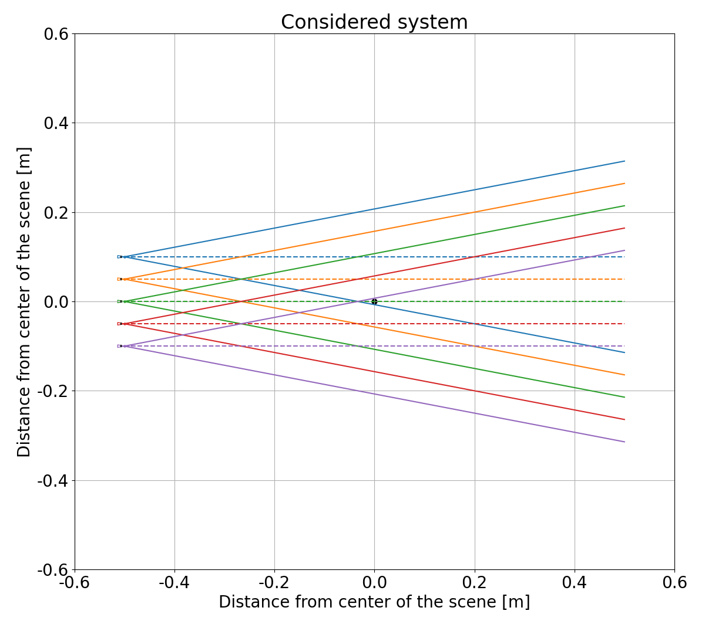
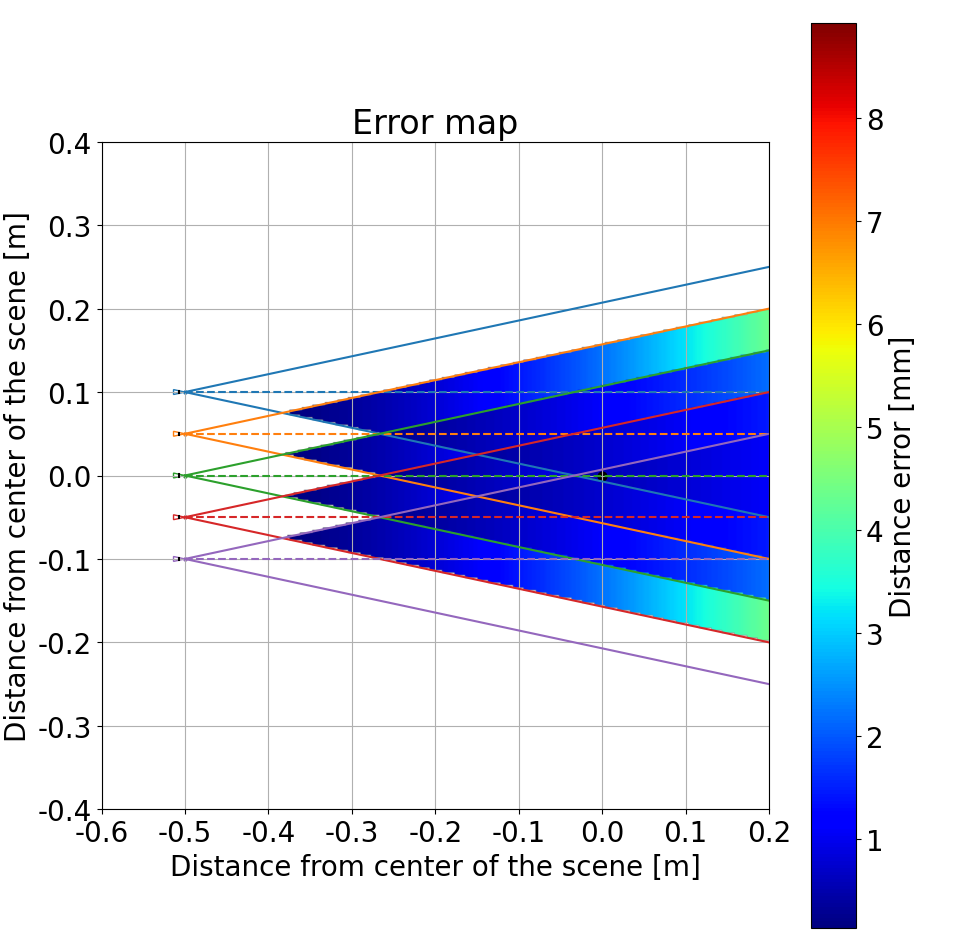
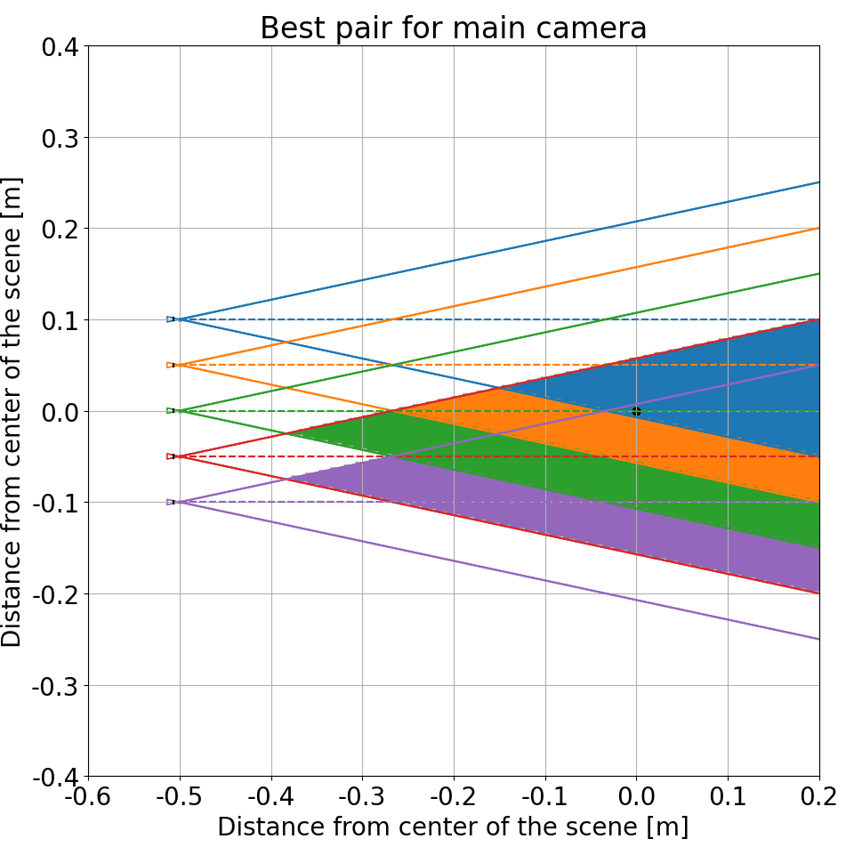
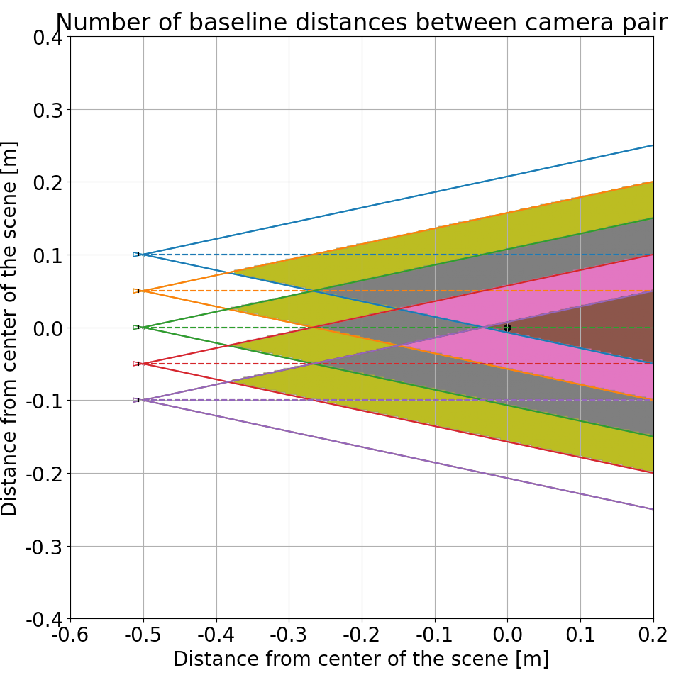

# DepthEstAcc - depth accuracy estimation for regular multicamera systems

## Descripton 

The presented software addresses a crucial challenge in depth estimation for static and moving scenes in multicamera systems by determining the maximum theoretically achievable quality of depth estimation. It focuses on estimating the geometry of multicamera scenes, an area extensively researched due to its importance in various applications, such as virtual reality. The software calculates the minimal possible depth estimation error for any given camera arrangement (linear or cirrcular), based on a disparity-based approach, providing valuable insights into the optimal configuration of cameras for high-precision depth mapping. This is particularly relevant for setups in immersive video and other applications requiring accurate scene reconstruction. While the software does not account for factors like occlusions or camera imperfections, it offers a powerful tool for analyzing and optimizing camera arrangements, potentially improving the overall quality of the system before complex processes like calibration are performed.

## Autors 

* Jakub Stankowski          - Poznan University of Technology, Poznań, Poland
* Krzysztof Klimaszewski - Poznan University of Technology, Poznań, Poland
* Adam Grzelka                - Poznan University of Technology, Poznań, Poland

## License

3-Clause BSD License

## Requirements 

Python library: 
- numpy,
- matplotlib,
- shapely.

## Usage

The software is delivered as a python script. Configuration is read from `confing.json` file.

Fill the file with your data and run the python script. 

**Running the script:**
`python depth_err.py`

## Configuration file

The behaviour of the script is defined by the contents of the configuration file named `confing.json`. A template is provided for modification.

### System parameters

In the configuration file, the following parameters can be modified:

- **NumberOfCameras** - the number of cameras in system,

Example:
> "NumberOfCameras": 5,

___

- **FocalLength_mm** - Cameras parameter,
- **SensorWidth_mm** - Cameras parameter,
- **Resolution_px** - Cameras parameter,

All cameras are assigned the same parameters (this is an usual case for regular camera setups to have the same cameras in the setup).

Example:
> "FocalLength_mm": 15,
> "SensorWidth_mm": 3,
> "Resolution_px": 1920,

___

- **MainCamera** - Camera index (starting from 0) for which the more i-depth analysis is prepared,

Example:
> "MainCamera": 3,

___

- **Linear system**- a dictionary with options for linear arrangement of cameras
    - **Generate** - Switch on and off generating results for linear system (0 is "off", 1 is "on"),
    - **CameraBasline** - distance in mm between cameras for linear system,

Example:
> "Linear": {
>     "Generate": 1,
>     "CameraBasline_mm": 50
> },

___

- **Circular system** - a dictionary with options for circular arrangement of cameras
    - **Generate** - Switch on and off generating results for circular system,
    - **CameraAngle** - angle in degrees between cameras for circular system,

Example:
> "Circular": {
>     "Generate": 0,
>     "CameraAngle_deg": 15
> },

___

- **DisplayDistance_mm** - The maximum distance from the cameras that will undergo analysis, can be understood as the size of the scene,

Example:
> "DisplayDistance_mm": 500,

___

- **ErrorMapResolution** - Resolution of the calculated model, this specifies the number of cells that the maximum distance (defined above) will be divided into

Example:

> "ErrorMapResolution": 100,

*for `DisplayDistance_mm` set to 500, this will define the resolution of the analysis of the scene to be 500/100 = 5 mm*

### Display options

All chosen options are shown and saved as separate pdf files.

- **DisplayFigures** - switch on displaying figure during generation, when turned off (0), only pdf files are generated

___

- **DrawSystemOverview** - switch on generation of system overview 

Example result:

___

- **DrawErrorMap** - switch on generation of error map

Example result:

*Here you can see the heat map of the lower bound of the depth estimation error for all parts of the scene that are covered by at least two cameras' viewing cones. This also shows the actualarea of the scene for which the depth map can be calculated at all.*
*In this example low resolution of the error map is used, it can be improved by setting a higher value of `ErrorMapResolution`.*

___

- **DrawCameraMap** - switch on drawing the camera map

Example result:

*Here you can see the best pairs for the main camera for calculating depth for given parts of the scene. The cameras are color coded. Themain camera is selected by variable `MainCamera`*

___

*Here you can see the map of the scene that shows how many baselines apart are the cameras chosen for best depth estimation of a given part of the scene, the number is color coded and the distances are shown with arrows to the left of the image*

___

- **DrawSimplified** - switch on using a simplified model for regular setups (less precise but much faster)

